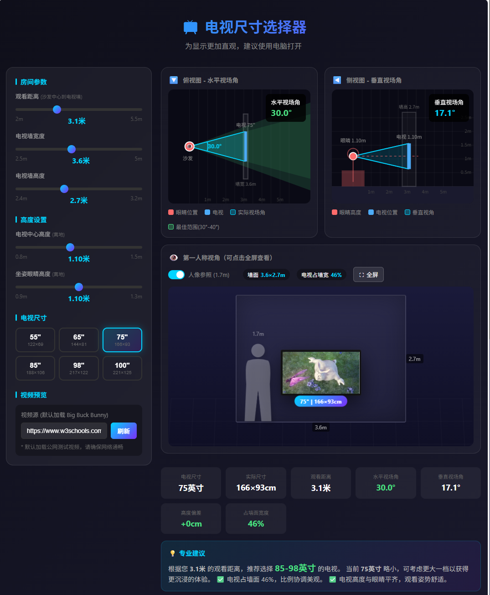

# 📺 电视尺寸选择器 (TV Size Selector)

> 一个基于 Web 的可视化工具，通过 2D 平面图与 3D 第一人称视角，帮助用户科学地选择适合自家客厅的电视尺寸。

## 📖 简介

在购买电视时，往往很难直观地感受 "75寸" 和 "85寸" 在实际客厅中的区别。这个工具通过输入观看距离、墙面尺寸等参数，实时生成：

1.  **俯视图 (Top View)**：展示水平视场角 (FOV)，判断是否符合沉浸感标准。
2.  **侧视图 (Side View)**：展示垂直视角与安装高度，预防颈椎疲劳。
3.  **3D 第一人称视角 (First-Person POV)**：模拟真实的客厅观感，支持视频贴图播放。

本项目为纯前端实现，单个 HTML 文件即可运行，零依赖。

## ✨ 功能特性

* **全参数自定义**：支持调节观看距离、墙面宽高、电视离地高度、坐姿眼睛高度。
* **多视图可视化**：
    * Canvas 绘制的精确平面布局图。
    * 基于 CSS 3D Transform 的沉浸式第一人称视角。
* **科学评估**：实时计算水平/垂直视场角，并基于 THX 等标准给出尺寸建议（过小/合适/沉浸/过大）。
* **实景模拟**：
    * 支持加载自定义视频 URL（测试网络视频）。
    * 支持全屏模式沉浸体验。
    * 提供 1.7m 人像参照物，直观对比比例。
* **零依赖**：原生 HTML/CSS/JS，无需 Node.js，无需构建，双击即用。

## 🚀 快速开始

### 在线体验
https://seanwong17.github.io/tv-size-selector/

https://tv-size-selector.netlify.app/

### 本地运行
1.  克隆本仓库或直接下载 ZIP。
2.  找到 `index.html` 文件。
3.  使用 Chrome / Edge / Safari 等现代浏览器直接打开即可。

## 🛠️ 技术实现

* **核心逻辑**：Vanilla JavaScript (ES6+)
* **2D 绘图**：HTML5 Canvas API
* **3D 场景**：CSS3 `perspective` & `transform: translateZ/rotateX`
* **样式**：原生 CSS3 (Flexbox/Grid 布局)

## ⚠️ 版权与许可 (License)

本项目采用 **[CC BY-NC-SA 4.0](https://creativecommons.org/licenses/by-nc-sa/4.0/deed.zh)** 国际许可协议进行授权。

### ✅ 你可以：
* **共享** — 在任何媒介以任何形式复制、发行本作品。
* **演绎** — 修改、转换或以本作品为基础进行创作。
* **学习与研究** — 用于个人学习、教学或非营利性研究。

### 🚫 严禁商用 (No Commercial Use)：
* **禁止** 将本项目及其衍生代码用于任何商业用途（包括但不限于付费服务、广告引流、企业官网、商业软件集成等）。
* **禁止** 未经作者明确授权的商业分发。

如果您希望将此代码用于商业场景，请务必先联系作者获得授权。

## 🤝 贡献

欢迎提交 Issue 或 Pull Request 来改进代码！
如果你发现计算逻辑有误或有更好的 UI 建议，请随时告诉我。
